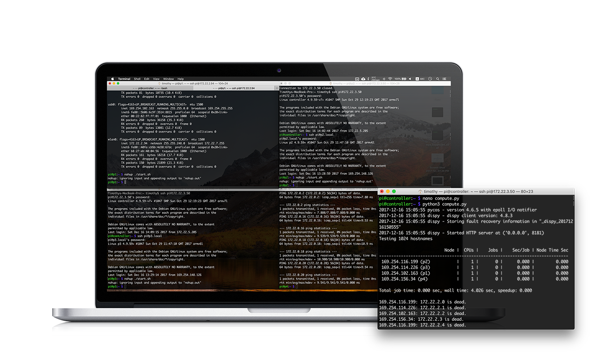
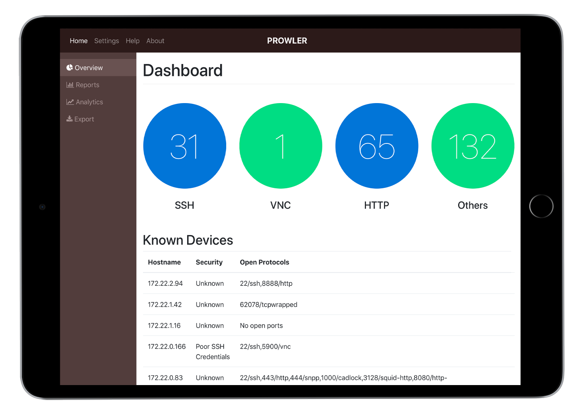
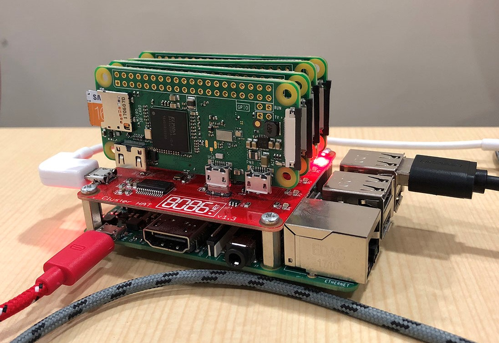
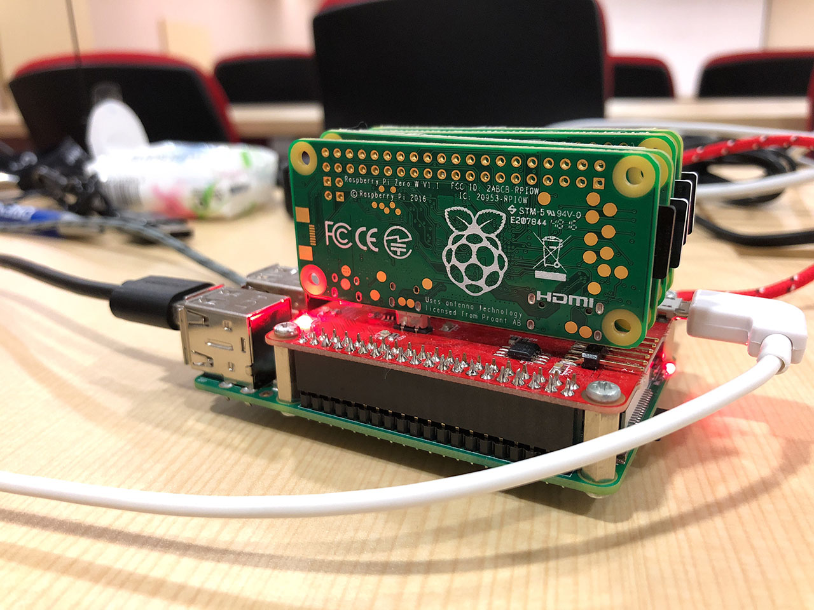
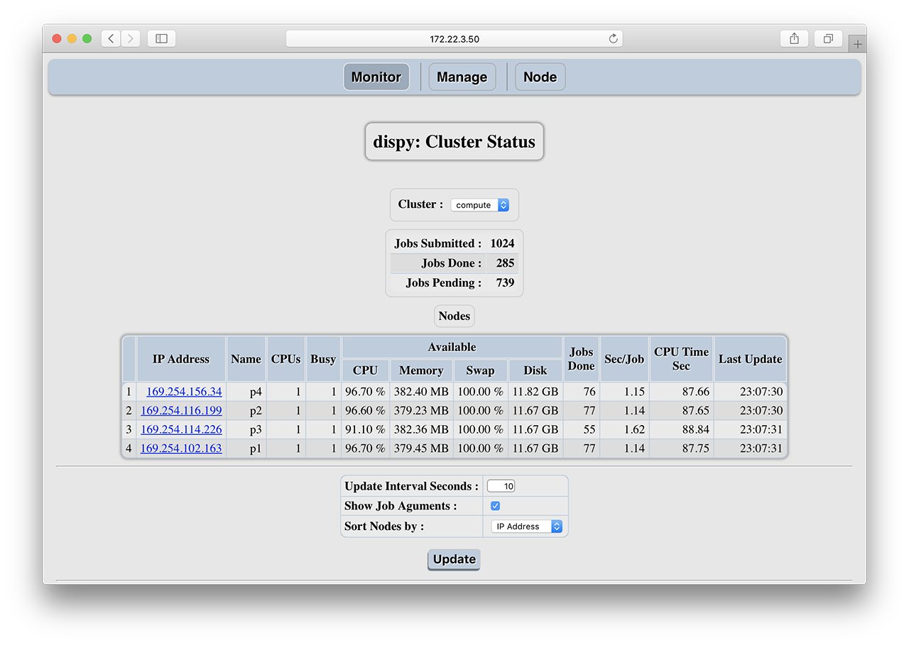

# Prowler
#### Raspberry Pi Cluster Network Vulnerability Scanner

## Why did we build Prowler?

*Often, security breaches are not due to hackers breaking through layers of tough security. They happen because someone didn't change their default passwords.*

The Mirai botnet case exploited under-secured IoT devices via easily guessable factory default (or popular) login credentials. This incident, along with many other copycat attempts, led our team wanted to propose a solution to aid users in securing their increasingly connected world.

Enterprises, NGOs and individuals can make use of such a system to catch common security lapses before a security breach occurs.

## What did we build Prowler to do?
-   Scan a network (or a particular subnet) for all IP addresses associated with active devices
-   Determine if there are any open ports on the device
-   Associate the ports with common services
-   Test devices against a dictionary of factory default and common credentials
-   Notify users of security lapses

### Take a Tour
- [Cluster Scan Demonstration Jupyter Notebook](http://nbviewer.jupyter.org/github/tlkh/prowler/blob/master/ClusterDemo.ipynb)
- [Single Scan Demonstration Jupyter Notebook](http://nbviewer.jupyter.org/github/tlkh/prowler/blob/master/SingleDemo.ipynb)
- Try out the web dashboard [here](https://tlkh.github.io/prowler/app/).

## How did we build Prowler?
### Hardware
-   Raspberry Pi [Cluster HAT](https://clusterhat.com/) (4 \* Pi Zero W)
-   Raspberry Pi 3
-   No external router needed!

### Software
-   Python 3.6
-   [nmap](https://nmap.org/)
-   [Dispy](http://dispy.sourceforge.net/)
-   Firebase
-   Bonus: [pssh](https://www.tecmint.com/execute-commands-on-multiple-linux-servers-using-pssh/)

## What else could Prowler potentially do?
-   Use Microsoft Bot Framework to proactively provide users with the real-time
    information from Firebase through channels such as Telegram, Slack and much more

## Useful Snippets
-   To run ssh command on multiple devices `pssh -h pssh-hosts -l username -A -i
    "command"`
-   To create the cluster (in `compute.py`): `cluster =
    dispy.JobCluster(compute, nodes='pi0_ip', ip_addr='pi3_ip')`
-   Check connectivity: `ping p1.local -c 1 && ping p2.local -c 1 && ping
    p3.local -c 1 && ping p4.local -c 1`
-   Temperature Check: `/opt/vc/bin/vcgencmd measure_temp && pssh -h workers -l
    pi -A -i "/opt/vc/bin/vcgencmd measure_temp" | grep temp`
-   rpimonitor:

#### Contributors:

- Faith See
- Wong Chi Seng
- Timothy Liu

